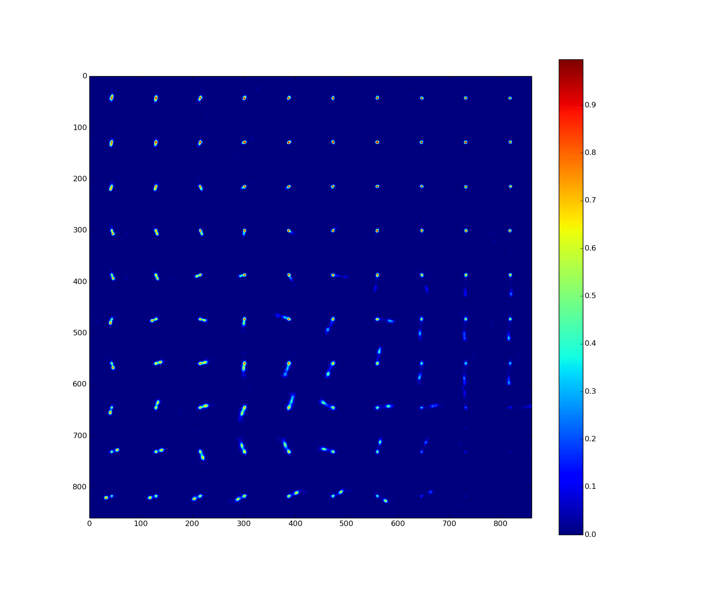

[](https://jenkins.h-its.org/job/AIN/job/GitHub%20HITS-AIN/job/PINK/job/master/)
[](https://gitter.im/HITS-AIN-PINK/Lobby?utm_source=badge&utm_medium=badge&utm_campaign=pr-badge&utm_content=badge)

# Parallelized rotation and flipping INvariant Kohonen maps (PINK)



## Requirements

  - CMake (Version >= 3.0, http://www.cmake.org)
  - CUDA (recommended)
  - gtest (optional)
  - doxygen (optional)


## Installation

  1) Make build directory and change into it:
  
     mkdir build && cd build

  2) Generate Makefile using cmake:

     cmake -DCMAKE_INSTALL_PREFIX=<INSTALL_PATH> ..

  3) Compile:

     make -j <number of cores>

  4) Execute the Tests

     make test

  5) Generate API documentation (if doxygen is available)

     make doc

  6) Install

     make install


## Usage

To train a the [self-organizing map](https://en.wikipedia.org/wiki/Self-organizing_map) (SOM) please execute
```
Pink --train <image-file> <result-file>
```
where `image-file` is the input file of images for the training and `result-file` is the output file for the trained SOM. All files are in binary mode described [here](https://github.com/HITS-AIN/PINK/wiki/Description-of-the-binary-file-formats).

To map an image to the trained SOM please execute
```
Pink --map <image-file> <result-file> <SOM-file>
```
where `image-file` is the input file of images for the mapping, `SOM-file` is the input file for the trained SOM, and `result-file` is the output file for the resulting heatmap.

Please use also the command `Pink -h` to get more informations about the usage and the options.


## Python scripts

For conversion and visualization of images and SOM some python scripts are available.

  - numpy2binary.py: Conversion of the python numpy file format into binary input file format for images.

  - jpg2binary.py:   Conversion of jpg images into binary input file format for images.
                     Three channels are used for red, green, and blue (RGB) color channels.
                 
  - showImages.py:   Visualize binary images file format.

  - showSOM.py:      Visualize binary SOM file format.

  - showHeatmap.py:  Visualize the mapping result.


## Publication

Kai Lars Polsterer, Fabian Gieseke, Christian Igel, Bernd Doser, and Nikos Gianniotis. Parallelized rotation and flipping INvariant Kohonen maps (PINK) on GPUs.
24th European Symposium on Artificial Neural Networks, Computational Intelligence and Machine Learning (ESANN), pp. 405-410, 2016.
[pdf](https://www.elen.ucl.ac.be/Proceedings/esann/esannpdf/es2016-116.pdf)


## License

Distributed under the GNU GPLv3 License. See accompanying file LICENSE or copy at http://www.gnu.org/licenses/gpl-3.0.html.
