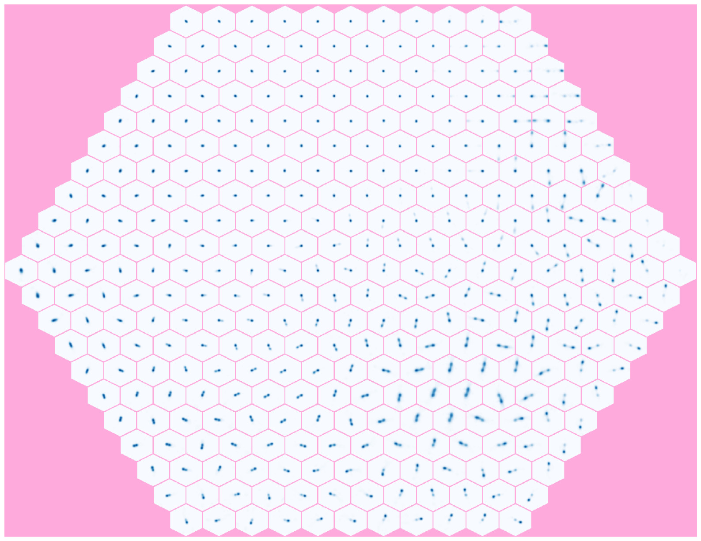

[](https://jenkins.h-its.org/job/AIN/job/GitHub%20HITS-AIN/job/PINK/job/master/)
[](https://gitter.im/HITS-AIN-PINK/Lobby?utm_source=badge&utm_medium=badge&utm_campaign=pr-badge&utm_content=badge)

# Parallelized rotation and flipping INvariant Kohonen maps (PINK)




## Requirements

  - C++ with ISO 14 standard (GCC 6.1 and above)
  - [CMake](https://cmake.org/) >= 3.0
  - CUDA >= 9.1 (highly recommended because of the speed-up)
  - [conan.io](https://conan.io/) (optional for C++ dependencies) or
    - [PyBind11](https://github.com/pybind/pybind11) (optional for Python interface)
    - [google-test](https://github.com/google/googletest) 1.8.1 (optional for unit tests)
  - doxygen 1.8.13 (optional for developer documentation)

Conan.io will install automatically the C++ dependencies (PyBind11 and google-test). Otherwise you can also install these libraries yourself.


## Installation

We provide deb- and rpm-packages at https://github.com/HITS-AIN/PINK/releases

or you can install PINK from the sources:

```bash
cmake -DCMAKE_INSTALL_PREFIX=<INSTALL_PATH> .
make install
```


## Usage

To train a the [self-organizing map](https://en.wikipedia.org/wiki/Self-organizing_map) (SOM) please execute
```
Pink --train <image-file> <result-file>
```
where `image-file` is the input file of images for the training and `result-file` is the output file for the trained SOM. All files are in binary mode described [here](https://github.com/HITS-AIN/PINK/wiki/Description-of-the-binary-file-formats).

To map an image to the trained SOM please execute
```
Pink --map <image-file> <result-file> <SOM-file>
```
where `image-file` is the input file of images for the mapping, `SOM-file` is the input file for the trained SOM, and `result-file` is the output file for the resulting heatmap.

Please use also the command `Pink -h` to get more informations about the usage and the options.


## Python scripts

For conversion and visualization of images and SOM some python scripts are available.

  - convert_data_binary_file.py     Convert binary data file from PINK version 1 to 2
  - data_precondition.py:           Convert numpy into binary files and scale data to be within the range [0.0, 1.0]
  - show_heatmap.py:                Visualize the mapping result
  - show_images.py:                 Visualize binary images file format
  - show_som.py:                    Visualize binary SOM file format
  - train.py:                       SOM training using the PINK Python interface

## Publication

[Kai Lars Polsterer](https://github.com/kai-polsterer), Fabian Gieseke, Christian Igel,
[Bernd Doser](https://github.com/BerndDoser), and Nikos Gianniotis. Parallelized rotation and flipping INvariant Kohonen maps (PINK) on GPUs.
24th European Symposium on Artificial Neural Networks, Computational Intelligence and Machine Learning (ESANN), pp. 405-410, 2016.
[pdf](https://www.elen.ucl.ac.be/Proceedings/esann/esannpdf/es2016-116.pdf)


## License

Distributed under the GNU GPLv3 License. See accompanying file LICENSE or copy at http://www.gnu.org/licenses/gpl-3.0.html.
